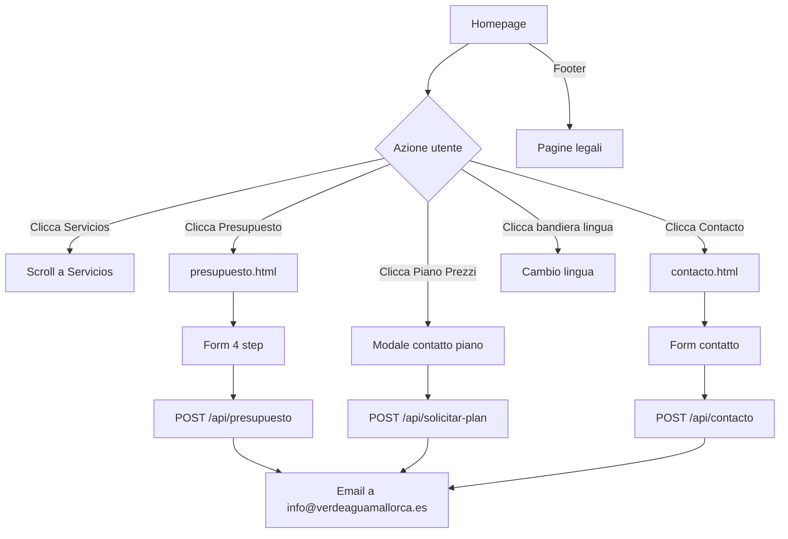

# 📗 Manuale Tecnico — VerdeAgua Website

> **Versione:** 1.0  
> **Data:** 17 Febbraio 2026  
> **Dominio:** verdeaguamallorca.es  
> **Repository:** [github.com/Alessiolucini/verdeagua](https://github.com/Alessiolucini/verdeagua)

---

## 1. Panoramica del Progetto

VerdeAgua è un sito web professionale per un'azienda di **servizi di paesaggistica e manutenzione di proprietà di lusso** a Mallorca. Il sito è progettato per attrarre clienti internazionali con un design premium e supporto multilingua.

### Stack Tecnologico

| Componente | Tecnologia |
|---|---|
| **Frontend** | HTML5, Tailwind CSS (via CDN), JavaScript vanilla |
| **Backend** | Node.js 20 + Express.js |
| **Email** | Nodemailer (SMTP Hostinger) |
| **Deploy** | Docker → Dokploy |
| **Font** | Playfair Display, Inter (Google Fonts) |
| **Icone** | Material Symbols Outlined (Google) |
| **Mappe** | Google Maps Embed API |

---

## 2. Struttura del Progetto

```
VERDEAGUA/
├── Dockerfile              # Container Docker (Node 20 Alpine)
├── DEPLOY.md               # Guida al deploy su Dokploy
├── package.json            # Dipendenze: express, nodemailer
├── server.js               # Server Express con API email
├── logo/                   # Asset del logo originale
├── assets/                 # Asset vari
└── site/
    └── public/             # ← File serviti staticamente
        ├── index.html              # Homepage principale
        ├── contacto.html           # Pagina contatti
        ├── presupuesto.html        # Form richiesta preventivo
        ├── aviso-legal.html        # Avviso legale
        ├── privacidad.html         # Privacy policy
        ├── cookies.html            # Cookie policy
        ├── translations.js         # Traduzioni homepage (~290 chiavi)
        ├── translations-pages.js   # Traduzioni sotto-pagine (~260 chiavi)
        ├── sitemap.xml             # Sitemap SEO
        ├── robots.txt              # Direttive crawler
        ├── logo-nav.png            # Logo navbar (chiaro)
        ├── logo-nav-dark.png       # Logo navbar (scuro)
        ├── intuify-logo.webp       # Logo footer (Intuify)
        ├── gestion-integral.png    # Immagine servizio
        ├── favicon-16x16.png       # Favicon 16px
        ├── favicon-32x32.png       # Favicon 32px
        └── apple-touch-icon.png    # Icona Apple Touch
```

---

## 3. Pagine del Sito

### 3.1 Homepage — `index.html`

La pagina principale del sito, contiene tutte le sezioni marketing.

| Sezione | Descrizione |
|---|---|
| **Hero** | Immagini di sfondo a rotazione, titolo con font serif, sottotitolo e CTA |
| **Trust Badges** | 4 badge (Equipo Experto, Cobertura Total, Garantía, Servicio 24/7) |
| **Servicios** | 4 card servizi: Jardinería, Piscinas, Reformas, Gestión Integral |
| **¿Por qué VerdeAgua?** | Sezione con 4 punti di forza + immagine |
| **Portfolio** | Griglia masonry con progetti realizzati |
| **Precios** | 3 piani di manutenzione (Esencial, Premium, Elite) con modale contatto |
| **Testimonios** | 3 testimonianze clienti |
| **Footer** | Contatti, servizi, newsletter, link legali, crediti Intuify |
| **Cookie Banner** | Banner GDPR con Accetta/Rifiuta |

**Funzionalità interattive:**
- **Hamburger menu** per navigazione mobile
- **Cambio lingua** con flag (🇪🇸 🇬🇧 🇩🇪 🇫🇷 🇮🇹)
- **Hero Slideshow** con transizione automatica delle immagini
- **Modale di contatto** per i piani di manutenzione (invia email)
- **Smooth scroll** verso le sezioni
- **Animazioni** hover su card e badge

---

### 3.2 Pagina Contatti — `contacto.html`

Pagina dedicata ai contatti con layout a due colonne.

**Colonna sinistra — Info di contatto:**
- Card Telefono: `+34 675 128 916`
- Card Email: `info@verdeaguamallorca.es`
- Card Ubicazione: Palma, Illes Balears
- Card Orari: Lun–Ven 8:00–19:00, Sab 9:00–14:00, Urgenze 24/7

**Colonna destra — Form di contatto:**
- Campi: Nome, Cognome, Email, Telefono, Servizio (dropdown), Messaggio
- Invio tramite API `/api/contacto`
- Stato di successo animato dopo l'invio

**Sezione mappa:**
- Google Maps embed con copertura Palma de Mallorca

---

### 3.3 Preventivo — `presupuesto.html`

Form multi-step per richiesta di preventivo gratuito.

| Step | Contenuto |
|---|---|
| **1 — Servizio** | Selezione servizio (Jardinería, Piscinas, Reformas, Mantenimiento) |
| **2 — Dettagli** | Frequenza, dimensione, upload foto (opzionale) |
| **3 — Ubicazione** | Zona/Municipio (Palma, Sóller, Deià, etc.), tipo proprietà, indirizzo |
| **4 — Contatto** | Nome, telefono, email, disponibilità preferita |

**Sidebar riepilogo:** mostra in tempo reale il riepilogo della richiesta.
**Invio:** tramite API `POST /api/presupuesto`

---

### 3.4 Pagine Legali

| Pagina | File | Contenuto |
|---|---|---|
| Avviso Legale | `aviso-legal.html` | Dati identificativi, condizioni d'uso, proprietà intellettuale, responsabilità, giurisdizione |
| Privacy Policy | `privacidad.html` | Responsabile trattamento, dati raccolti, finalità, base legale, diritti, sicurezza |
| Cookie Policy | `cookies.html` | Tipi di cookie (tecnici, analitici, marketing), gestione, contatto |

Tutte le pagine legali condividono:
- Nav con logo + bandiere lingua
- Footer compatto
- Cookie banner
- Traduzioni in 5 lingue

---

## 4. Sistema di Traduzioni (i18n)

Il sito supporta **5 lingue**: Spagnolo (default), Inglese, Tedesco, Francese, Italiano.

### Funzionamento

1. Ogni elemento traducibile ha l'attributo `data-i18n="chiave"`
2. Al caricamento, il sistema rileva la lingua del browser o usa quella salvata in `localStorage`
3. Lo script attraversa tutti gli elementi con `data-i18n` e sostituisce il testo

### File di traduzione

| File | Pagine servite | N° chiavi approx. |
|---|---|---|
| `translations.js` | `index.html` | ~290 chiavi |
| `translations-pages.js` | `contacto.html`, `presupuesto.html`, `aviso-legal.html`, `privacidad.html`, `cookies.html` | ~260 chiavi |

### Formato

```javascript
const translations = {
    "nav.servicios": {
        es: "Servicios",
        en: "Services",
        de: "Dienste",
        fr: "Services",
        it: "Servizi"
    },
    // ...
};
```

### Rilevamento lingua

```
1. Controlla localStorage('va_lang')
2. Se non presente, rileva navigator.language
3. Mappa: de→DE, en→EN, fr→FR, it→IT, default→ES
4. Salva la scelta in localStorage per visite future
```

### Cambio lingua manuale

Le bandiere nella nav chiamano `switchLanguage('xx')` o `setPageLang('xx')`, che invocano la funzione `applyLang(lang)`.

---

## 5. Backend — Server Express

### File: `server.js`

Il server serve i file statici e gestisce le API per l'invio di email.

### Configurazione SMTP

```
Host:     smtp.hostinger.com
Porta:    465 (SSL)
Utente:   info@verdeaguamallorca.es
Password: variabile d'ambiente SMTP_PASS
```

### API Endpoints

#### `POST /api/presupuesto`

Riceve i dati dal form di preventivo e invia un'email HTML stilizzata.

| Campo | Tipo | Obbligatorio |
|---|---|---|
| nombre | string | ✅ |
| telefono | string | ✅ |
| email | string | ✅ |
| servicios | string | ✅ |
| frecuencia | string | ❌ |
| tamano | string | ❌ |
| zona | string | ❌ |
| tipoProp | string | ❌ |
| direccion | string | ❌ |
| notas | string | ❌ |
| disponibilidad | string | ❌ |

**Risposta:**
- `200 { success: true }` — email inviata
- `400 { error: '...' }` — campi mancanti
- `500 { error: '...' }` — errore SMTP

**Email generata:**
- **Da:** `"VerdeAgua Web" <info@verdeaguamallorca.es>`
- **A:** `info@verdeaguamallorca.es`
- **Reply-To:** email del cliente
- **Oggetto:** `🌿 Nuevo Presupuesto: {servizio} — {nome} ({zona})`
- **Corpo:** HTML stilizzato con card per dati cliente, dettagli proprietà, e note

---

#### `POST /api/solicitar-plan`

Riceve richieste per piani di manutenzione dalla sezione prezzi della homepage.

| Campo | Tipo | Obbligatorio |
|---|---|---|
| nombre | string | ✅ |
| telefono | string | ✅ |
| email | string | ✅ |
| plan | string | ✅ |
| precio | string | ❌ |

**Email generata:**
- **Oggetto:** `Mantenimiento {plan} — {nome}`
- **Corpo:** HTML con dati cliente e piano richiesto

---

#### `POST /api/contacto`

Endpoint per il form della pagina contatti (frontend implementato, **backend da aggiungere** — attualmente il form invierà i dati ma il server non ha ancora questo endpoint).

> [!IMPORTANT]
> L'endpoint `/api/contacto` non è ancora implementato in `server.js`. Va aggiunto con la stessa logica degli altri endpoint.

---

#### `GET *` (Fallback)

Qualsiasi route non trovata restituisce `index.html` (comportamento SPA-like).

---

## 6. Design System

### Palette Colori

| Nome | Valore | Uso |
|---|---|---|
| Primary | `#2d5016` | Verde scuro — CTA, titoli, accenti |
| Background Light | `#faf8f5` | Sfondo pagine |
| Sandstone | `#f0ebe3` | Sfondo secondario, card |
| Charcoal | `#1a1a1a` | Testo principale, footer |

### Tipografia

| Font | Uso |
|---|---|
| **Playfair Display** (serif) | Titoli, hero, intestazioni sezioni |
| **Inter** (sans-serif) | Corpo del testo, navigazione, bottoni |

### Componenti Ricorrenti

- **Glass Nav:** `background: rgba(250,248,245,0.8)` + `backdrop-filter: blur(12px)`
- **Card:** `bg-white rounded-xl shadow-sm border border-primary/5`
- **CTA Button:** `bg-primary text-white rounded-lg font-bold shadow-lg`
- **Cookie Banner:** fixed bottom, `bg-charcoal` con bordi arrotondati

---

## 7. Responsive Design

Il sito è completamente responsive con breakpoint Tailwind:

| Breakpoint | Larghezza | Adattamenti |
|---|---|---|
| **Mobile** | < 640px | Hamburger menu, colonne singole, testo ridotto |
| **sm** | ≥ 640px | Padding aumentato, griglie 2 colonne |
| **md** | ≥ 768px | Layout desktop parziale |
| **lg** | ≥ 1024px | Nav desktop completa, griglie 3-4 colonne |

### Hamburger Menu

- Visibile sotto `1024px` (`lg:hidden`)
- Pannello full-screen con overlay scuro
- Blocca lo scroll del body quando aperto
- Include bandiere lingua e CTA

---

## 8. SEO

### Sitemap — `sitemap.xml`

```xml
<url>
  <loc>https://verdeaguamallorca.es/</loc>
  <priority>1.0</priority>
  <changefreq>weekly</changefreq>
</url>
<!-- + contacto.html (0.9), presupuesto.html (0.9) -->
<!-- + aviso-legal, privacidad, cookies (0.3) -->
```

### Robots — `robots.txt`

```
User-agent: *
Allow: /
Sitemap: https://verdeaguamallorca.es/sitemap.xml
```

### Meta Tags

Ogni pagina include:
- `<title>` descrittivo con keyword
- `<meta name="description">` (homepage e contatto)
- `<meta name="viewport">` per responsive
- Favicon in 3 formati (16px, 32px, Apple Touch)

---

## 9. Deploy e Infrastruttura

### Dockerfile

```dockerfile
FROM node:20-alpine
WORKDIR /app
COPY package.json ./
RUN npm install --production
COPY server.js ./
COPY site/ ./site/
EXPOSE 80
CMD ["node", "server.js"]
```

### Deploy su Dokploy

1. **Repository:** `https://github.com/Alessiolucini/verdeagua`
2. **Branch:** `main`
3. **Build Type:** Dockerfile
4. **Porta interna:** 80
5. **SSL:** Let's Encrypt (HTTPS automatico)

### Variabili d'Ambiente

| Variabile | Descrizione | Default |
|---|---|---|
| `PORT` | Porta del server | `80` |
| `SMTP_PASS` | Password email SMTP | (hardcoded fallback) |

> [!WARNING]
> La password SMTP è attualmente hardcoded come fallback in `server.js`. Si consiglia di impostarla come variabile d'ambiente `SMTP_PASS` in Dokploy per maggiore sicurezza.

---

## 10. Flusso Utente



---

## 11. Riepilogo dei Lavori Effettuati

### ✅ Creazione del sito
- Design premium con palette verde/sandstone
- Hero section con slideshow immagini
- 4 card servizi con prezzi e CTA
- Sezione "Perché VerdeAgua" con 4 vantaggi
- Portfolio con griglia masonry
- 3 piani di manutenzione con modale contatto
- 3 testimonianze clienti
- Footer completo con newsletter

### ✅ Sistema multilingua
- 5 lingue: ES, EN, DE, FR, IT
- ~550 chiavi di traduzione totali
- Rilevamento automatico lingua browser
- Persistenza scelta lingua in localStorage
- Bandiere interattive nella nav

### ✅ Form Preventivo (multi-step)
- 4 step con sidebar riepilogo
- Upload foto (opzionale)
- Selezione zona Mallorca
- Invio email HTML stilizzata

### ✅ Pagina Contatti
- Hero banner con titolo animato
- 4 card info (telefono, email, ubicazione, orari)
- Form contatto con dropdown servizio
- Google Maps embed
- Design responsive

### ✅ Pagine legali
- Aviso Legal, Privacy, Cookie policy
- Tradotte in 5 lingue
- Conformi GDPR

### ✅ Design responsive
- Hamburger menu mobile
- Layout adattivi per tutti i breakpoint
- Touch targets ottimizzati
- Griglie responsive (1→2→3→4 colonne)

### ✅ Backend email
- Server Express con 2 endpoint API
- Email HTML stilizzate con branding VerdeAgua
- SMTP via Hostinger

### ✅ SEO
- `sitemap.xml` con priorità per pagina
- `robots.txt`
- Meta tag su ogni pagina
- Favicon multi-formato

### ✅ Correzione email
- Aggiornato da `info@verdeagua.net` a `info@verdeaguamallorca.es`

### ✅ Deploy
- Dockerfile pronto
- Guida Dokploy in `DEPLOY.md`

---

## 12. Manutenzione Futura

### Aggiungere una nuova pagina
1. Creare il file HTML in `site/public/`
2. Copiare la struttura di nav, footer e cookie banner da `contacto.html`
3. Aggiungere le chiavi di traduzione in `translations-pages.js`
4. Aggiornare `sitemap.xml`

### Aggiungere una nuova lingua
1. Aggiungere la chiave lingua a ogni entry in `translations.js` e `translations-pages.js`
2. Aggiungere la bandiera nella nav di ogni pagina HTML
3. Aggiungere il codice lingua nei check di `detectLang()`

### Modificare i prezzi dei piani
Cercare le sezioni `pricing` in `index.html` (circa riga 560–660) e aggiornare i valori. Le traduzioni dei prezzi sono in `translations.js` con chiave `pricing.*`.

### Aggiungere un nuovo endpoint API
1. Aggiungere la route in `server.js` seguendo lo schema degli endpoint esistenti
2. Aggiornare il frontend per chiamare il nuovo endpoint
3. Rebuild e deploy del container Docker
